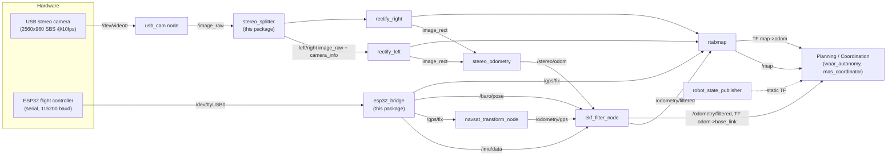

# SLAM Package — IARC Mission 10

ROS 2 package that turns raw sensor data (stereo camera, ESP32 IMU/GPS/barometer) into a filtered drone pose and a 2D occupancy map, using `robot_localization` and RTAB-Map. This README covers everything a new team member needs to install, configure, run, and understand the package.

## Table of Contents

1. [Overview](#1-overview)
2. [Directory Structure](#2-directory-structure)
3. [Prerequisites](#3-prerequisites)
4. [Installation](#4-installation)
5. [Configuration](#5-configuration)
6. [Usage](#6-usage)
7. [Interfaces](#7-interfaces)
8. [Package Architecture](#8-package-architecture)
9. [Expected Output](#9-expected-output)
10. [Troubleshooting](#10-troubleshooting)
11. [Future Improvements](#11-future-improvements)
12. [Contributing](#12-contributing)

---

## 1. Overview

### Purpose

The `slam` package is the **localization and mapping layer** for the drone. It ingests raw sensor streams — a side-by-side stereo camera and an ESP32 flight-controller feed (IMU, GPS, barometer) — and fuses them into:

- A filtered 6-DoF pose estimate (`/odometry/filtered`)
- A stereo visual-odometry estimate (`/stereo/odom`)
- A 2D occupancy grid map (`/map`)
- The `map → odom → base_link` TF chain

It does **not** do path planning or mission logic — that lives in `waar_autonomy` and `mas_coordinator`. This package's only job is to answer "where is the drone, and what does the world around it look like."

### Key Features

- **Single-camera stereo splitting** — one USB camera streaming a combined side-by-side (SBS) image is split into synchronized left/right mono frames with correctly scaled camera intrinsics.
- **Custom ESP32 serial bridge** — converts a lightweight CSV serial protocol from the flight controller into standard `sensor_msgs`/`geometry_msgs` topics.
- **Layered sensor fusion** — `robot_localization` (EKF + GPS transform) fuses IMU attitude, GPS position, barometer altitude, and stereo visual odometry into one filtered pose; RTAB-Map then builds a graph-optimized map on top of that.
- **One-file launch** — the entire stack (camera driver, rectification, odometry, EKF, SLAM) is brought up with a single launch file.

### Where It Fits in the Autonomy System

```
 slam (this package)               waar_autonomy / mas_coordinator
┌─────────────────────────┐        ┌──────────────────────────────┐
│ sensors -> pose + map    │  --->  │ planning, exploration,        │
│ /odometry/filtered       │        │ multi-drone coordination      │
│ /map, TF map->odom->base │        │ (consumes pose/map, does NOT  │
└─────────────────────────┘        │  do localization itself)      │
                                    └──────────────────────────────┘
```

This package is a producer for the rest of the autonomy stack: `ros2_adapter_v2` (in `waar_autonomy`) and the MAS coordination nodes rely on a real, continuously-updating pose to publish `PoseBeacon`/`PoseStamped` messages and to geo-reference mine candidates. If this package isn't running (or its output is stale), everything downstream is flying blind.

---

## 2. Directory Structure

```
slam_package/
└── slam/                          ROS 2 (ament_python) package — the only package in this folder
    ├── config/
    │   ├── ekf_gps.yaml           robot_localization EKF + navsat_transform parameters
    │   ├── left.yaml              Left camera intrinsics (ROS camera_info YAML)
    │   ├── right.yaml             Right camera intrinsics (ROS camera_info YAML)
    │   └── ost.txt                Raw "oST" calibration dump that left/right.yaml were generated from
    ├── launch/
    │   └── slam.launch.py         Single launch file that starts every node in the stack
    ├── resource/
    │   └── slam                   Empty ament resource-index marker (required by ament_python, do not delete)
    ├── slam/                      Python module containing this package's two custom nodes
    │   ├── __init__.py
    │   ├── esp32_bridge.py        Serial bridge: ESP32 flight controller -> /imu/data, /gps/fix, /baro/pose
    │   └── stereo_splitter.py     Splits one SBS camera stream into left/right mono images + CameraInfo
    ├── test/                      Standard ament lint tests (flake8, pep257, copyright) — no functional tests yet
    ├── urdf/
    │   └── drone.urdf             Static robot description: base_link + camera/imu/gps frames
    ├── package.xml                ROS package manifest and exec dependencies
    ├── setup.py                   ament_python build config + console_script entry points
    └── setup.cfg                  ament_python script install locations
```

---

## 3. Prerequisites

| Requirement | Details |
|---|---|
| **ROS version** | ROS 2 Humble Hawksbill (matches the rest of this workspace, e.g. `mas_coordinator`) |
| **OS** | Ubuntu 22.04 (bare metal or the workspace Docker image) |
| **Camera hardware** | USB stereo camera that outputs one combined side-by-side (SBS) MJPEG stream at `2560x960 @ 10 fps` on `/dev/video0` (each eye is `1280x960` before the splitter halves resolution) |
| **Flight controller hardware** | ESP32-based flight controller streaming IMU/GPS/baro over serial, default `/dev/ttyUSB0 @ 115200` baud, using a comma-separated `yaw,roll,pitch,lat,lon,alt` line protocol |

> Hardware is only required to run the full stack live. You can still build and launch the package without a camera/ESP32 attached — `usb_cam` and `esp32_bridge` will simply fail to connect and log errors, while the rest of the graph stays up.

### ROS Package Dependencies (`package.xml`)

- `robot_state_publisher`
- `robot_localization`
- `rtabmap_ros`, `rtabmap_slam`, `rtabmap_odom`
- `image_proc`
- `camera_calibration`
- `usb_cam`

### Python Dependencies

The two custom nodes import packages that are **not currently declared in `package.xml`** — install them manually (see [Future Improvements](#11-future-improvements)):

- `pyserial` (imported as `serial`, used by `esp32_bridge`)
- `opencv-python` (`cv2`, used by `stereo_splitter`)
- `cv_bridge` (ROS/OpenCV image conversion)
- `pyyaml` (`yaml`, used to parse calibration files)

---

## 4. Installation

### 1. Clone into your workspace

```bash
cd /ros2_ws/src
git clone <this-repo-url> waar-iarc-m10
# The package lives at: waar-iarc-m10/Autonomy/slam_package/slam
```

### 2. Install ROS dependencies

```bash
sudo apt update
sudo apt install \
  ros-humble-robot-state-publisher \
  ros-humble-robot-localization \
  ros-humble-rtabmap-ros \
  ros-humble-image-pipeline \
  ros-humble-usb-cam
```

`ros-humble-image-pipeline` provides both `image_proc` and `camera_calibration`. Alternatively, run `rosdep install --from-paths src --ignore-src -r -y` from the workspace root if `rosdep` is set up.

### 3. Install Python dependencies

```bash
pip install pyserial opencv-python pyyaml
sudo apt install ros-humble-cv-bridge
```

### 4. Build the workspace

```bash
cd /ros2_ws
colcon build --packages-select slam
```

### 5. Source the workspace

```bash
source /opt/ros/humble/setup.bash
source /ros2_ws/install/setup.bash
```

Add both lines to `~/.bashrc` if you'll be working in this workspace regularly.

---

## 5. Configuration

### Node Parameters

| Node | Parameter | Default | Meaning |
|---|---|---|---|
| `esp32_bridge` | `port` | `/dev/ttyUSB0` | Serial device for the flight controller |
| `esp32_bridge` | `baudrate` | `115200` | Serial baud rate |
| `stereo_splitter` | `left_calib` | *(from launch file)* | Path to left camera's `camera_info` YAML |
| `stereo_splitter` | `right_calib` | *(from launch file)* | Path to right camera's `camera_info` YAML |

RTAB-Map and `stereo_odometry` parameters (feature count, sync behavior, grid settings, frame IDs) are set inline in `slam.launch.py` rather than in a separate YAML file — see [`slam.launch.py`](slam/launch/slam.launch.py) if you need to tune them.

### Configuration Files

- **`config/ekf_gps.yaml`** — `robot_localization` parameters:
  - `ekf_filter_node`: fuses barometer Z (`/baro/pose`), GPS-derived XY (`/odometry/gps`), stereo velocity (`/stereo/odom`), and IMU orientation/angular velocity (`/imu/data`) at 30 Hz, publishing the `odom → base_link` TF.
  - `navsat_transform`: converts raw GPS fixes into the odometry frame at 10 Hz. **`magnetic_declination_radians` defaults to `0.0`** — update this for your local area before flying (see [Troubleshooting](#10-troubleshooting)).
- **`config/left.yaml`, `config/right.yaml`** — per-eye camera intrinsics (camera matrix, distortion, rectification, projection) in ROS `camera_info` YAML format, calibrated at the camera's full per-eye resolution (`1280x960`). `stereo_splitter` halves these values at runtime to match its downscaled output — **if you recalibrate, calibrate against the full-resolution split frames, not the downscaled ones.**
- **`config/ost.txt`** — the raw calibration output from ROS's `camera_calibration` tool (`cameracalibrator.py`), kept as the source record `left.yaml`/`right.yaml` were derived from.

### Launch Files

- **`launch/slam.launch.py`** — the only launch file. It starts every node in the stack (see [Package Architecture](#8-package-architecture)). Device paths (`/dev/video0`, `/dev/ttyUSB0`), image resolution, and framerate are currently **hardcoded** in this file rather than exposed as launch arguments — edit it directly to point at different hardware.

### Environment Variables

None are required by this package specifically. Standard ROS 2 environment variables apply (`ROS_DOMAIN_ID`, `RMW_IMPLEMENTATION`, etc.). On the host OS, your user typically needs to be in the `dialout` group (serial) and `video` group (camera) to access `/dev/ttyUSB0` and `/dev/video0` without `sudo`.

---

## 6. Usage

### Launching the Package

```bash
source /ros2_ws/install/setup.bash
ros2 launch slam slam.launch.py
```

This single command brings up the camera driver, stereo splitter, ESP32 bridge, image rectification, EKF, GPS transform, stereo odometry, and RTAB-Map — see [Package Architecture](#8-package-architecture) for the full graph.

### Example Commands

```bash
# Confirm sensor data is flowing
ros2 topic hz /imu/data
ros2 topic echo /gps/fix --once

# Confirm fused pose and map are being produced
ros2 topic hz /odometry/filtered
ros2 topic echo /map --once --field info

# Inspect the TF tree
ros2 run tf2_tools view_frames

# Visualize in RViz (Fixed Frame = map)
rviz2
```

### Typical Workflow

1. Power on the ESP32 flight controller and connect the stereo camera.
2. Launch the package: `ros2 launch slam slam.launch.py`.
3. Verify `/imu/data`, `/gps/fix`, and `/baro/pose` are publishing (confirms the ESP32 bridge is connected).
4. Verify `/camera/left/image_rect` and `/camera/right/image_rect` are publishing (confirms the camera + rectification pipeline is working).
5. Verify `/odometry/filtered` is publishing at ~30 Hz and `/map` is populating in RViz.
6. Hand off to the planning/coordination stack (`waar_autonomy` / `mas_coordinator`), which consumes `/odometry/filtered` and the `map → odom → base_link` TF chain.

---

## 7. Interfaces

### Published Topics

| Topic | Type | Published By |
|---|---|---|
| `/imu/data` | `sensor_msgs/msg/Imu` | `esp32_bridge` (orientation only — see [limitations](#11-future-improvements)) |
| `/gps/fix` | `sensor_msgs/msg/NavSatFix` | `esp32_bridge` |
| `/baro/pose` | `geometry_msgs/msg/PoseWithCovarianceStamped` | `esp32_bridge` (Z position only) |
| `/camera/left/image_raw`, `/camera/right/image_raw` | `sensor_msgs/msg/Image` (mono8) | `stereo_splitter` |
| `/camera/left/camera_info`, `/camera/right/camera_info` | `sensor_msgs/msg/CameraInfo` | `stereo_splitter` |
| `/camera/left/image_rect`, `/camera/right/image_rect` | `sensor_msgs/msg/Image` | `image_proc` (`rectify_left`, `rectify_right`, launched by this package) |
| `/odometry/gps` | `nav_msgs/msg/Odometry` | `navsat_transform_node` (`robot_localization`) |
| `/odometry/filtered` | `nav_msgs/msg/Odometry` | `ekf_filter_node` (`robot_localization`) |
| `/stereo/odom` | `nav_msgs/msg/Odometry` | `stereo_odometry` (`rtabmap_odom`) |
| `/map` | `nav_msgs/msg/OccupancyGrid` | `rtabmap` (`rtabmap_slam`) |

RTAB-Map also publishes its own standard diagnostic/graph topics (map data, optimized graph, etc.) under `/rtabmap/*`; run `ros2 topic list | grep rtabmap` once launched to see the full set for your `rtabmap_ros` version.

### Subscribed Topics

| Topic | Type | Subscribed By |
|---|---|---|
| `/image_raw` | `sensor_msgs/msg/Image` | `stereo_splitter` (raw SBS frame from `usb_cam`) |
| `/camera/left/image_raw`, `/camera/right/image_raw` (+ `camera_info`) | `sensor_msgs/msg/Image`, `sensor_msgs/msg/CameraInfo` | `image_proc` rectify nodes |
| `/camera/left/image_rect`, `/camera/right/image_rect` (+ `camera_info`) | `sensor_msgs/msg/Image`, `sensor_msgs/msg/CameraInfo` | `stereo_odometry`, `rtabmap` |
| `/imu/data`, `/gps/fix` | `sensor_msgs/msg/Imu`, `sensor_msgs/msg/NavSatFix` | `navsat_transform_node`, `ekf_filter_node` |
| `/baro/pose`, `/odometry/gps`, `/stereo/odom` | see above | `ekf_filter_node` |
| `/odometry/filtered`, `/gps/fix` | `nav_msgs/msg/Odometry`, `sensor_msgs/msg/NavSatFix` | `rtabmap` |

### Services

This package defines no custom services. Once running, `rtabmap` (from `rtabmap_slam`) exposes its standard service set (e.g. resetting the map, dumping map data, switching localization mode) — run `ros2 service list | grep rtabmap` to see what's available for your installed version.

### Actions

None.

### TF Frames

Static frames (published by `robot_state_publisher` from [`urdf/drone.urdf`](slam/urdf/drone.urdf)):

```
base_link (root)
├── camera_left_frame    (+0.05 m Y offset)
├── camera_right_frame   (-0.05 m Y offset)
├── imu_link              (co-located with base_link)
└── gps_link               (co-located with base_link)
```

Dynamic frames:

| Transform | Published By |
|---|---|
| `odom → base_link` | `ekf_filter_node` (`publish_tf: true`) |
| `map → odom` | `rtabmap` |

---

## 8. Package Architecture

`slam.launch.py` starts nine nodes. This package contributes two of them (`esp32_bridge`, `stereo_splitter`); the rest are stock nodes from other ROS packages, wired together and configured by this launch file.



**Data flow summary:**

1. **Sensing** — `usb_cam` grabs the combined stereo frame; `esp32_bridge` polls the flight controller's serial link at 50 Hz.
2. **Preprocessing** — `stereo_splitter` splits/downscales the SBS frame into calibrated left/right mono images; `image_proc` rectifies both.
3. **Odometry** — `stereo_odometry` computes visual odometry from the rectified stereo pair; `navsat_transform_node` converts the GPS fix into the odometry frame.
4. **Fusion** — `ekf_filter_node` fuses IMU orientation, barometer altitude, GPS position, and stereo velocity into `/odometry/filtered`.
5. **Mapping** — `rtabmap` combines the rectified stereo images, the filtered odometry, and GPS into a globally-consistent pose graph and occupancy grid (`/map`), publishing `map → odom`.

---

## 9. Expected Output

On a successful launch with hardware connected, you should see log lines similar to:

```
[esp32_bridge]: Connected to ESP32 on /dev/ttyUSB0 at 115200 baud.
[usb_cam]: ...device opened...
[rectify_left]: ...
[ekf_filter_node]: ...
[navsat_transform]: ...
[rtabmap]: ...RTAB-Map initialized...
[stereo_odometry]: ...
```

And, once everything is warmed up:

- `ros2 topic hz /odometry/filtered` reports ~30 Hz.
- `ros2 topic hz /imu/data` reports ~50 Hz (bounded by the ESP32 bridge's poll timer).
- In RViz with **Fixed Frame = `map`**: a `TF` tree rooted at `map`, an `OccupancyGrid` display on `/map` that grows as the drone moves, and (if you add an `Odometry` display) a smooth `/odometry/filtered` path following the drone's real trajectory.

If the camera or ESP32 is not connected, the corresponding node logs a connection error but the rest of the graph still comes up — `/map` and `/odometry/filtered` just won't receive the sensor data they depend on.

---

## 10. Troubleshooting

| Symptom | Likely Cause | Fix |
|---|---|---|
| `esp32_bridge` logs "Failed to connect to /dev/ttyUSB0" | Wrong device path, or user lacks serial permissions | Check `ls /dev/ttyUSB*` / `dmesg \| tail`; add your user to the `dialout` group (`sudo usermod -aG dialout $USER`, then log out/in) |
| `esp32_bridge` logs "Error parsing serial data" repeatedly | Baud rate mismatch, bad cable, or firmware sending a different line format | Confirm firmware baud rate matches the `baudrate` parameter; confirm the line is exactly 6 comma-separated values `yaw,roll,pitch,lat,lon,alt` |
| `usb_cam` fails to open `/dev/video0` | Wrong device index, or camera doesn't support the configured resolution/format | Check `v4l2-ctl --list-devices` and `v4l2-ctl -d /dev/video0 --list-formats-ext`; the camera must support MJPEG at `2560x960` |
| `stereo_splitter` logs "Calibration file path is empty!" | `left_calib`/`right_calib` parameters weren't resolved (path not found under `share/slam/config`) | Rebuild (`colcon build --packages-select slam`) so the config files are installed; confirm the launch file's `get_package_share_directory('slam')` path is correct |
| RTAB-Map never produces a map / logs about missing synchronized data | Left/right image and camera_info timestamps aren't aligned (`approx_sync: False` requires exact sync) | Confirm `stereo_splitter` is stamping left/right identically (it copies the source frame's stamp); check `topic_queue_size`/`sync_queue_size` if frames are being dropped |
| EKF output drifts or jumps in heading | `magnetic_declination_radians` left at the default `0.0` | Set it to the correct declination for your flying location in `config/ekf_gps.yaml` |
| TF errors ("frame does not exist") in RViz | `robot_state_publisher` didn't start, or started after nodes that need the TF tree | Confirm `ros2 topic echo /robot_description --once` returns the URDF; restart the launch |
| No image data even though `usb_cam` is running | `stereo_splitter` expects `mono8`-convertible input; pixel format mismatch | Confirm `usb_cam`'s `pixel_format` parameter is `mjpeg2rgb` (as set in the launch file) and matches what the camera actually streams |

General debugging tips:

```bash
ros2 node list                     # confirm all 9 nodes are up
ros2 topic list                    # confirm expected topics exist
ros2 topic hz <topic>              # confirm a topic is actually publishing
ros2 param get /ekf_filter_node <param_name>   # inspect a running node's parameters
ros2 run tf2_tools view_frames     # dump the current TF tree to a PDF
```

---

## 11. Future Improvements

### Known Limitations

- **Undeclared Python dependencies** — `pyserial`, `opencv-python`, `cv_bridge`, and `pyyaml` are imported by the custom nodes but not listed in `package.xml`; `rosdep`/dependency installs won't pull them in automatically.
- **Hardcoded launch parameters** — device paths, resolution, and framerate in `slam.launch.py` aren't exposed as `LaunchConfiguration` arguments, so switching hardware requires editing the launch file directly.
- **Placeholder package metadata** — `package.xml`/`setup.py` still have `TODO` description, license, and a placeholder maintainer email.
- **Partial IMU data** — `esp32_bridge` only publishes orientation (no linear acceleration or angular velocity measurements); it marks the missing covariances with a `-1.0` sentinel per the `sensor_msgs/Imu` convention, which downstream consumers must handle correctly.
- **No serial framing/checksum** — the ESP32 line protocol is plain comma-separated values with no checksum or start/end delimiter, so a torn or corrupted line is simply dropped (logged as a warning) rather than recovered.
- **No functional test coverage** — `test/` only contains the standard ament lint tests (flake8, pep257, copyright); there are no unit tests for `esp32_bridge`'s parsing logic or `stereo_splitter`'s calibration scaling.
- **No checked-in RViz config** — visualizing the stack currently requires manually adding displays (TF, `/map`, `/odometry/filtered`).

### TODO

- Externalize launch-time hardware parameters (video device, serial port, resolution, framerate) as launch arguments.
- Add `pyserial`, `opencv-python`/`cv_bridge`, and `pyyaml` as proper dependencies (`exec_depend`/`rosdep` keys).
- Add unit tests for `esp32_bridge` line parsing and `stereo_splitter` calibration scaling.
- Add a checked-in RViz config for quick visualization.
- Fill in `package.xml` description, license, and maintainer fields.

---

## 12. Contributing

### Coding Standards

This package follows standard `ament_python` conventions:

- **Lint before committing**: `flake8`, `pep257` (docstring style), and `ament_copyright` checks are already wired up in `test/`.
- Nodes are plain `rclpy.node.Node` subclasses; runtime-tunable values should be exposed via `declare_parameter`, matching the existing pattern in `esp32_bridge` and `stereo_splitter`.

### Testing Expectations

```bash
cd /ros2_ws
colcon build --packages-select slam
colcon test --packages-select slam
colcon test-result --verbose
```

Since this package currently has no functional tests, new logic (parsing, calibration math, message construction) should come with unit tests under `test/` rather than relying solely on lint checks.

### How to Submit Changes

1. Create a feature branch.
2. Make your changes, keeping node responsibilities separate (don't mix hardware-interface logic into fusion/mapping nodes or vice versa).
3. Run `colcon build` and `colcon test` for the `slam` package and confirm they pass.
4. If you touched sensor wiring, calibration, or the serial protocol, note the hardware/firmware version you tested against in your PR description — these changes are hard to verify from code review alone.
5. Open a PR against `main` describing what changed and why.
